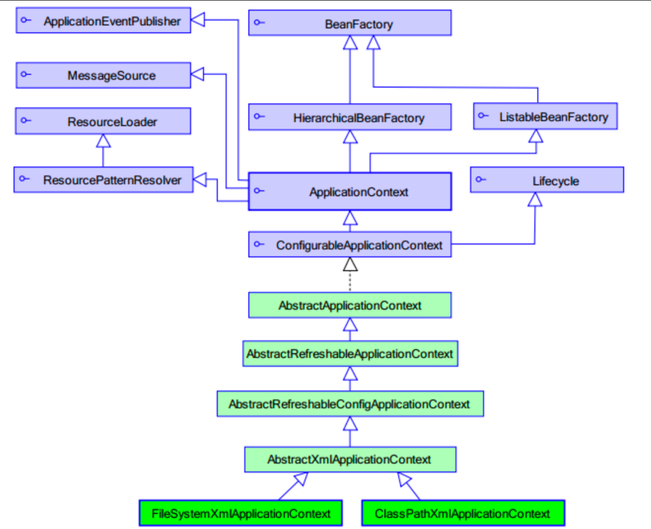

# Spring工厂结构

# Spring工厂结构

BeanFactory顶层接口

ApplicationContext子接口

BeanFactory和ApplicationContext的区别

- 创建对象和时间点不一样
  - ApplicationContext：只要读取配置文件，默认情况下就会创建对象
  - BeanFactory：使用时创建对象

ApplicationContext接口实现类

- ClassPathXmlApplicationContext

  从类的根路径下加载配置文件
- FIleSystemXmlApplicationContext

  从磁盘路径上加载配置文件，配置文件可以在磁盘的任意位置
- AnnotationConfigApplicationContext

  使用注解配置容器对象时，使用此类来创建Spring容器
